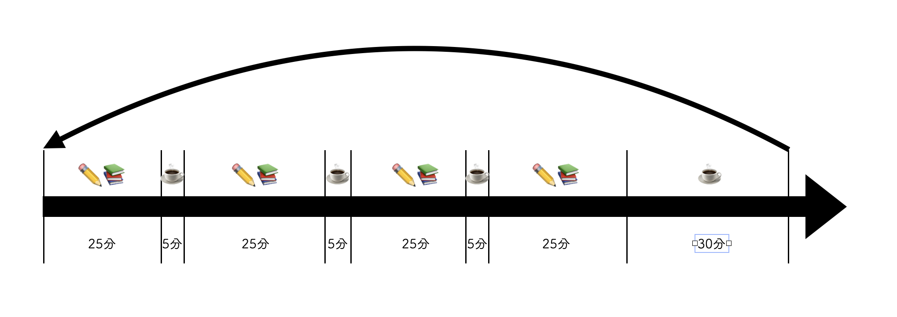

## はじめに

調べると先駆者がいました。悔しいですが、まあ、パッと思いつけるようなことは大抵誰かがやっているものです：
https://men-bou.net/pomodoro_training/

参考文献としてはっつけておきます。

## ポモドーロ勉強法
多くの記事で見かけるのは
- 25分間集中して勉強
- 5分間休憩
のサイクルを繰り返すという勉強法です。4サイクルを回したら30分程度の長めの休憩をとります。
こまめに休憩を挟むことで集中力の維持に期待できるそうです。

このポモドーロというのはもともとイタリア語の*pomodoro* (トマトの意)から来ているそうで、イタリア人の発案者フランチェスコ・シリロが当時トマト型のキッチンタイマーを使用していとのことです。
https://ja.wikipedia.org/wiki/%E3%83%9D%E3%83%A2%E3%83%89%E3%83%BC%E3%83%AD%E3%83%BB%E3%83%86%E3%82%AF%E3%83%8B%E3%83%83%E3%82%AF

最近では実証実験もされていて、どうやら休憩を自分で調整するグループと比較して、生産性のレベルに優位差がないらしいです。また、学習のサイクルが進むにつれて急激に疲労が増加することが優位に示されたらしいです。自分の意思で休めないことから、十分な回復ができていないかもしれないということが説明されています (Eva J. C. Smith *et al.* (2025))。

https://www.mdpi.com/2076-328X/15/7/861

## ポモドーロ筋トレ勉強法
上記でマイナスなことを言ってしまいましたが、そんなこたぁどうでもいいわけですよ。そんなこと棚に上げてとにかくやれ。

ということで、25分間勉強して、5分間の休憩は筋トレします。これはすごく効率がいいです。学習中は体の休憩、筋トレ中は脳みその休憩ができるのですから。

