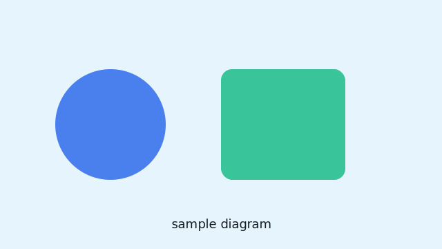

# H1 見出し

本文に**太字**、*斜体*、`インラインコード`、~~取り消し線~~を含めます。

## H2 見出し

- 箇条書きリスト1
- 箇条書きリスト2
  - ネスト1

1. 番号付き1
2. 番号付き2

> 引用: これは引用の例です。

表の例:

| 列A | 列B |
| --- | --- |
| a1  | b1  |
| a2  | b2  |

行内数式の例: $a^2 + b^2 = c^2$。

ブロック数式の例:

$$
\sum_{i=1}^{n} i = \frac{n(n+1)}{2}
$$

コードブロック（TypeScript）:

```ts
type Post = { title: string; date: string; tags: string[] };
const posts: Post[] = [
  { title: 'A', date: '2025-01-01', tags: ['demo'] },
  { title: 'B', date: '2025-02-01', tags: ['demo','test'] },
];
console.log(posts.map(p => p.title).join(', '));
```

画像の例: 記事フォルダ内の相対パス参照。



リンクの例: [トップページ](/)


## H2
### H3
#### H4
##### H5
###### H6
