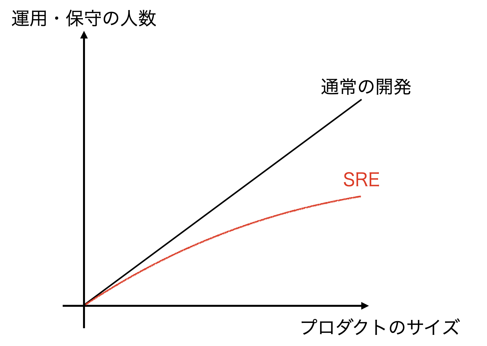

この記事は、2025年7月に、某所にてオンサイトで行われたSREトレーニングの復習のため、書いたものです。          
ただの情報の羅列で、ほとんど生の情報なので、間違いがあるとおもいます。鵜呑みにせず、ご覧ください。

--- 

## 1
- Product size $\propto$ 保守
- 普通はコストはlinearに上昇する
- SREはそうではない

- Google --> Container base
- SRE **3000人** で、40億個のpodを支えている（linearであればこうはいかない）

## 2. SREの原則

1. いかなるシステムにおいえて、最も重要な機能は、信頼性である
2. 監視が信頼性を決めるのではい。ユーザが決める。
3. 
    - 巧妙に設計されたソフトウェアはあ99.9%の信頼性
    - 巧妙に設計された運用は99.99%の信頼性
    - 巧妙に設計された〇〇は99.999%の信頼性 (<-- 聞き取れなかった)

- 本番デプロイ --> 失敗したらロールバック。この方が効率がいい。

## 3. DevOpsとの違い
- 開発は速度重視
- 運用は安定重視
- 上記２つは本質的に競合する

製品ライフサイクル
1. コンセプト
2. ビジネス
3. 開発
4. 運用
5. 市場

- SRE、SLOが2, 3, 4を解決
- 開発者はそれなりに動くプラットフォームがあれば嬉しい

| DevOps | SRE |
|---|---|
| 組織の壁を減らす | 責任を共有 |
| 失敗は普通のこと。受け入れる | SLO & 非難のないポストモーテム　|
| 段階的に変更　| 失敗のコストを下げる　|
| ツールと自動化を活用　| ソリューションを構築し、xxx |
| 全て測る | 影響の定量化、トイルも信頼性も定量化 |

- インフラを構築するのはSREではなく、インフラエンジニア。SREがレビューする。
- 可用性。難しい指標であるが、超重要。
- Googleの裏側。
  - たくさん障害
  - ポストモーテムが並んでいる

## 4 SREの用語

信頼性とは

- CUJ: Critical User Journyの略。ユーザの目的冠水までの動作。
- SLI: Service Level Indicatorの略。図でいうと「軸」（$x$軸のこと）。
- SLO: Service Level Objectiveの略。割合で与えられる。$0 \leq {\rm SLO} \leq 1$
- Error Budget: $1 - {\rm SLO}$
- SLA: Service Level Agreementの略。（返金対応とかする）

CUJからSLIを決定し、そのSLIに対してSLOを設定する。Error Budgetを使い切らなければ、たくさん開発、たくさんデプロイ。Error Budgetを使い切りそうだったら、安定稼働。デプロイ戦略の指標の１つ。

- SLIは比率で評価

$$
\begin{align}
    {\rm SLI} = \frac{\rm OK ~ event}{\rm All ~ evnets}
\end{align}
$$

- SLOとSLA

*e.g.,*  
CUJ: xx msec以内に... （時間の情報必須）  
SLIの種類: 可用性  
仕様: 2xx, 3xx, 4xxはOKとする。429はX。  
SLO: 99.9%が良いレスポンス　<--あまり良くない書き方。書き方は「過去28日で99.9%」のように想定時間を決める

SUJ --> SLIの種類 --> SLIの仕様 --> SLIの実装 --> SLO

SLOが高すぎても良くない。ユーザがアホみたいにリクエストする。ユーザが構築するシステムの耐障害性の観点。

コンテナを吹き飛ばそう。カオスエンジニアリングを実施しよう！

---

Error badget: 許容できる不具合の量。99.99%の可用性が30日間保たれるとすると、4.32分しかエラーが許されない。コンテナの再起動したら、この時間を使い切ってしまう。99.9%なら21.6分なのでなんとかなりそう！

SLOは社内向け。文書化する。メトリクスベースでまだ余裕があるエラーか、そうではないのか？
- バジェット豊富
  - たくさん新機能を追加
  - Challenging
- バジェット消費
  - 保守的に
  - 信頼性を優先

- バジェットが開発余力。
  - ビッグバンリリースはせずに、新機能ができたらすぐリリースしようぜ！
  - 価値を届けるレートを維持
- スプリントを合わせて考える
  - エラーバジェットは使い切らないように。
  - いきなり新機能を導入してくれと偉い人たちに言われることもある。
  - Googleはエラーバジェットをダッシュボード化している。
  - 他のチームのエラーバジェットも可視化されているらしい。

## 7 リスク分解
- これもユーザ目線
- リトライ戦略
- リトライで適切にエラーバジェットを避けていればOK（ユーザの影響小）
- ダッシュボードを作成して定量的に判断
  - SLOが適切が定期的にレビュー
- 密結合
  - これ全体でSLIが自然
- エラーバジェットでコミュニケーション

## 8 実践（文化超大事）
- 指標（大前提。どうなるとまずいのかを定量的に）
- キャパシティ
- 変更管理（ロールバック）
- 緊急対応（明確な障害 <-- CUJ）
- 文化（Googleにはレッドボタンがある --> 切り戻しボタン（ロールバック用））